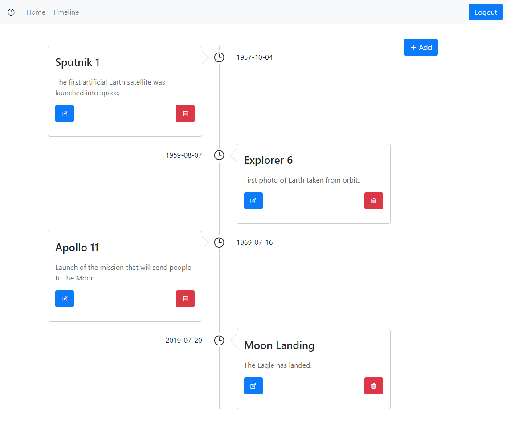
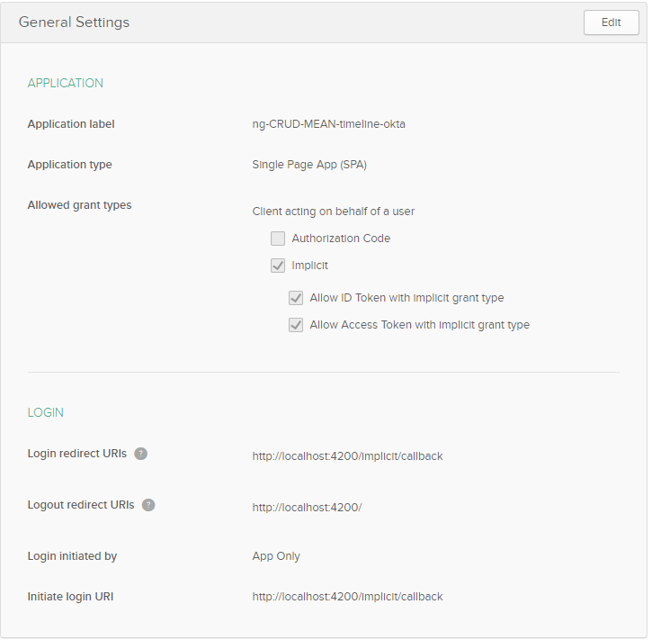

# NgCRUDMEANTimeline

An example of a timeline app build with Angular, a REST-API and a JWT authentication system using Okta.com as an authentication service. The app was build with the help of this tutorial at: [https://dzone.com/articles/tutorial-connect-your-angular-app-to-mysql](https://dzone.com/articles/tutorial-connect-your-angular-app-to-mysql).

App preview:




Used technologies:
- Frontend: Angular 10, Okta.com User Authentication
- Backend: RESTful API, Node.js, Express, JWT, MySQL database

> Important: install exactly the dependency versions used in the tutorial.

> Problem: Property 'initAuth' does not exist on type 'typeof OktaAuthModule'. Fix and Solution of the problem: Use Okta 2 instead of version 1 and use newer examples like: https://github.com/okta/samples-js-angular/tree/master/custom-login

## Dependencies
- Angular 10
- Node.js 14.8 LTS
- Node.js Express 4.17.1
- CORS 2.8.5
- mysql@2.17.1
- OktaAuthModule version 1 (old)
- Bootstrap 5.1.0
- ngx-timeline@5.0.0

## Development server

Run `ng serve --open` for a dev server. Navigate to `http://localhost:4200/`. The app will automatically reload if you change any of the source files.

## Build

Run `ng build` to build the project. The build artifacts will be stored in the `dist/` directory. Use the `--prod` flag for a production build.


---


# Documentation: A short historical timeline how I build this app

## Prerequisition

- An already installed MySQL or MariaDB database server.
- Node.js with npm.

## Create database

Login into database:

```shell
$ mysql -h localhost -u root -p
```

Within the MySQL command line create a database, create a new user, grant rights to the user and create a single table:

```sql
create database timeline;
use timeline;

// create a user and grant all rights to the currently created database
create user 'timeline_user'@'localhost' identified by 'timeline_user_password';
grant all on timeline.* to 'timeline_user'@'localhost';

// create the table
create table events (
  id INT AUTO_INCREMENT,
  owner VARCHAR(255) NOT NULL,
  name VARCHAR(255) NOT NULL,
  description TEXT,
  date DATE,
  PRIMARY KEY (id),
  INDEX (owner, date)
);

quit
```

## Set up a Simple CRUD Node Express Server

```shell
npm init
```

Install dependencies for the backend:

```shell
npm install --save-exact express@4.17.1 cors@2.8.5 mysql@2.17.1
```

> Fix for error: "Error: ER_NOT_SUPPORTED_AUTH_MODE: Client does not support authentication protocol":
```sql
ALTER USER 'timeline_user'@'localhost' IDENTIFIED WITH mysql_native_password BY 'timeline_user_password';
```

Start the backend server:
```shell
node .\server\src\index.js
```

Install dependencies for the Angular frontend:
```shell
npm install --save-exact express-bearer-token@2.4.0 @okta/jwt-verifier@1.0.0
```

## Okta.com settings
https://developer.okta.com/



## The Angular Client

```shell
ng add ngx-bootstrap@5.1.0
```

```shell
npm install --save-exact ngx-timeline@5.0.0 @okta/okta-angular@1.2.1
```

## Further information
https://github.com/oktadeveloper/okta-angular-mysql-timeline-example

https://github.com/holgerschmitz/angular_timeline

https://developer.okta.com/blog/2019/05/13/angular-8-spring-boot-2
